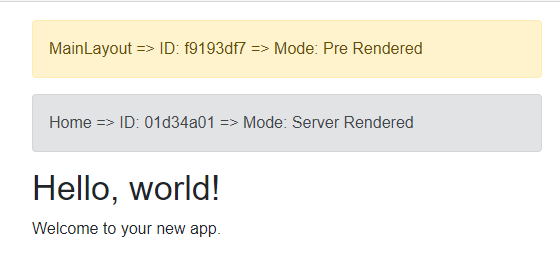
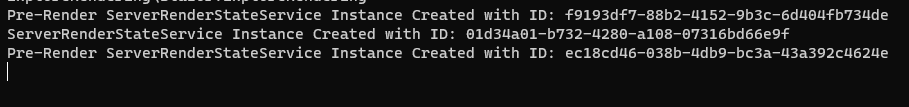

# Blazor.RenderLogger

*RenderLogger* is a Nuget package that provides some infrastructure to log and display the render mode of components.

### Adding the RenderLogger to a Solution

On any *Blazor Web Project* template, add the following Nuget packages to the projects:

Web Server :

```xml
<PackageReference Include="Blazr.RenderLogger" Version="0.1.2" />
<PackageReference Include="Blazr.RenderLogger.Server" Version="0.1.2" />
```

Client :

```xml
<PackageReference Include="Blazr.RenderLogger" Version="0.1.2" />
<PackageReference Include="Blazr.RenderLogger.WASM" Version="0.1.2" />
```

Add the following services to the Server `Program`:

```csharp
builder.AddRenderStateServerServices();
```

And the following services to the Client `Program`:

```csharp
builder.AddRenderStateWASMServices();
```

And add the following `using` to both project's `_Imports.razor`.

```csharp
@using Blazr.RenderLogger
```

## Adding the Component to Pages/Components

Add the following component to `Home`, `Counter` and `Weather` below the `Page Title` :

```csharp
@page "/"
<PageTitle>Home</PageTitle>
<RenderStateViewer Parent="this" />
//...
```

Add it to `MainLayout`

```csharp
        <article class="content px-4">
            <RenderStateViewer Parent="this" />
            @Body
        </article>
```

Modify `Weather` to run in interactive auto mode.

```csharp
@page "/weather"
@rendermode InteractiveAuto
```

Modify `Home` to run in interactive server mode.

```csharp
@page "/"
@rendermode InteractiveServer
```

A typical output:



And Console log:


